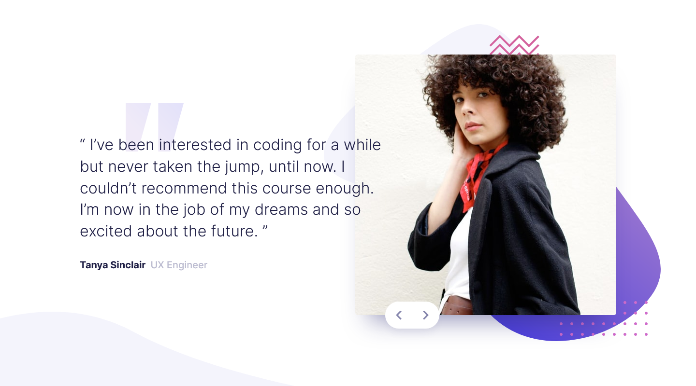

# Frontend Mentor - Coding bootcamp testimonials slider solution

This is a solution to the [Coding bootcamp testimonials slider challenge on Frontend Mentor](https://www.frontendmentor.io/challenges/coding-bootcamp-testimonials-slider-4FNyLA8JL). Frontend Mentor challenges help you improve your coding skills by building realistic projects. 

## Table of contents

- [Overview](#overview)
  - [The challenge](#the-challenge)
  - [Screenshot](#screenshot)
  - [Links](#links)
- [My process](#my-process)
  - [Built with](#built-with)
  - [What I learned](#what-i-learned)
  - [Continued development](#continued-development)
  - [Useful resources](#useful-resources)
- [Author](#author)
- [Acknowledgments](#acknowledgments)

## Overview

### The challenge

Users should be able to:

- View the optimal layout for the component depending on their device's screen size
- Navigate the slider using either their mouse/trackpad or keyboard

### Links

- Solution URL: [Check out the Solution here](https://www.frontendmentor.io/solutions/testimonials-slider-with-animations-xgs8jx3aqa)
- Live Site URL: [Checkout the Live Site here](https://abedfetrat.github.io/fem08-coding-bootcamp-testimonials-slider)

### Screenshot

Desktop

Mobile

## My process

### Built with

- Semantic HTML5 markup
- CSS custom properties
- Flexbox
- CSS Grid
- Mobile-first workflow

### What I learned

I learned to use ES6 modules to split the Javascript code, the Slider into a component like format. 

### Continued development

I would spend some more time on creating cooler animations. 

### Useful resources

- [Article on building a more accessible carousel](https://dev.to/jasonwebb/how-to-build-a-more-accessible-carousel-or-slider-35lp) - This helped me when building the slider with accessibility in mind. 

## Author

- Frontend Mentor - [@abedfetrat](https://www.frontendmentor.io/profile/abedfetrat)
- Twitter - [@abedfetrat](https://www.twitter.com/abedfetrat)
- LinkedIn - [@abedfetrat](https://www.linkedin.com/in/abedfetrat)